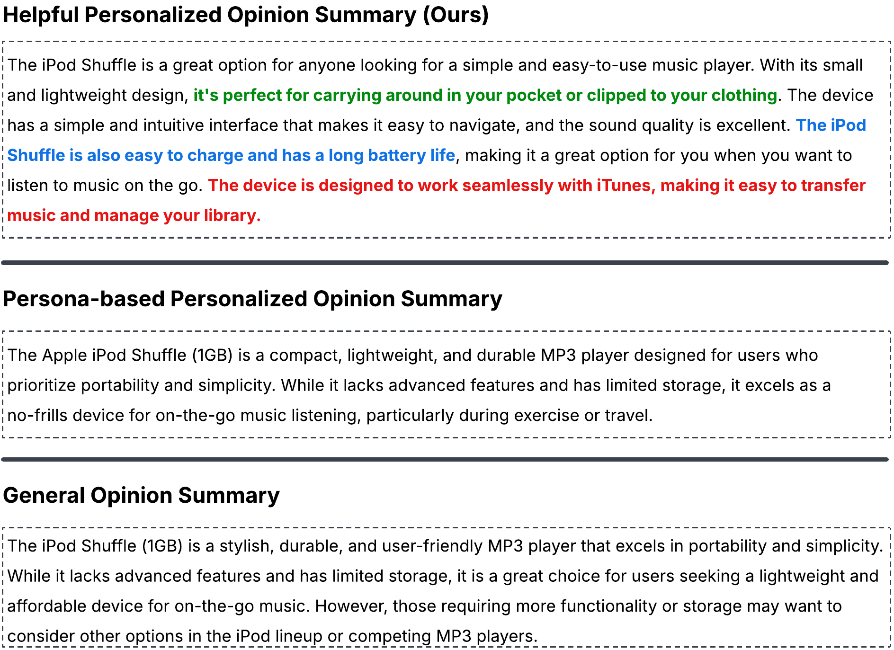
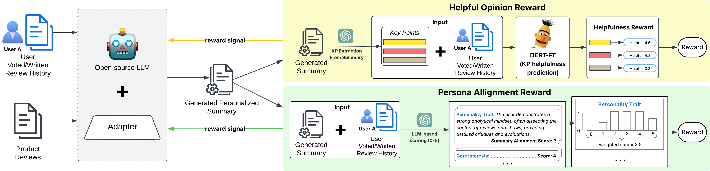
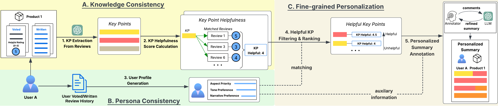

<div align="center">

# HELPFULSUMM: Personalized Helpful Opinion Summarization via Reinforcement Learning from Review Helpfulness Votes

</div>

This repository maintains the code, data, and model checkpoints for the paper *HELPFULSUMM: Personalized Helpful Opinion Summarization via Reinforcement Learning from Review Helpfulness Votes*

We advanced personalized opinion summarization (POS) by leveraging historical user helpfulness
votes on reviews to better model user interests and ground the generation of personalized summary in opinions helpful to the users.



## The HELPFULSUMM Model
We proposed HELPFULSUMM, a reinforcement learning-based model that utilizes user historical helpfulness votes to align with user preference in both Knowledge Consistency and Persona Consistency.
HELPFULSUMM is trained in two stages following the standard RLHF training paradigm.

[//]: # (- **Stage 1: Supervised Fine-tuning**: First obtain a base summarizer **HelpfulSumm-FT** )

[//]: # (by instruction-finetuning an LLM to equip it with the capability to perform the POS task in end-to-end manner.)

[//]: # ()
[//]: # ([//]: # &#40;with Chain-of-Thought &#40;CoT&#41; prompt&#41;)
[//]: # ([//]: # &#40;that guides the model to identify &#40;1&#41; the user profile and &#41;)
[//]: # ([//]: # &#40;&#40;2&#41; profile-conditioned helpful key points &#40;KPs&#41; during summary generation&#41;)
[//]: # (- **Stage 2: Reinforcement Learning**: we further optimize HelpfulSumm-FT )

[//]: # (via reinforcement learning of the generated summary output using 2 reward models:)

[//]: # (  - **Helpful Opinion Reward:** Use a fine-tuned DeBERTa model to estimate user helpfulness scores &#40;0-5&#41;, i.e., averaged votes, on opinions captured in the summary based on historical user-voted reviews )

[//]: # (  - **Persona Alignment Reward:** Use an LLM to infer the user profile from historical user-voted reviews and score the alignment of the summary to each profile's characteristic accordingly)

### Stage 1: Supervised Finetuning
We first obtain a base summarizer (**HelpfulSumm-FT**) by instruction-finetuning an LLM to equip it with the capability to perform the POS task in end-to-end manner.

### Stage 2: Reinforcement Learning
We further optimize HelpfulSumm-FT via reinforcement learning of the generated summary output using 2 reward models:
- **Helpful Opinion Reward:** Use a fine-tuned DeBERTa model to estimate user helpfulness scores (0-5), i.e., averaged votes, on opinions captured in the summary based on historical user-voted reviews 
- **Persona Alignment Reward:** Use an LLM to infer the user profile from historical user-voted reviews and score the alignment of the summary towards each of the six profile characteristics (e.g., personality traits) accordingly



All prompts are located under [```/prompts```](/prompts)

[//]: # (#### Fine-tuning a DeBERTa model for Helpful Opinion Reward)

### Model Checkpoint
For ease of reproducibility, we provided the trained model checkpoints of HELPFULSUMM, using quantized version (4 bit, group size 128) of Llama-3.1-8B-Instruct (due to computational limitation for training).  
Model checkpoint can be downloaded from this [Google Drive link](https://drive.google.com/file/d/12dZLHgrChs9rHcog8qpr0LntlxicTrmt/view?usp=sharing).
Please download the file and unzip the ```/models``` directory into the main working directory.

### Inference

## The CiaoHelpful Dataset
We proposed CiaoHelpful, a new dataset specialized for training and evaluation of end-to-end models for helpful personalized opinion summarization.
CiaoHelpful annotates gold summary of product personalized for a user in 5 stages:
- *Stage 1 - KP Extraction from User Reviews:* Extract key points, short i.e., short salient sentences representing review opinions, from reviews voted or written by the user on the product (as gold source of preferred knowledge)  
- *Stage 2 - KP Helpfulness Score Calculation:* Calculate helpfulness scores at the KP (opinion level), by matching extracted KPs (Stage 1) with user-voted reviews and calculate the average helpfulness votes of matching reviews.
- *Stage 3 - User Profile Generation:* Infer the user profile based on their historical voted/written-reviews from similar products
- *Stage 4 - Helpful KP Filtering & Ranking:* Select KPs with high helpfulness score (Stage 2) and make sure they also aligns with the user profile (Stage 3) as gold helpful KPs to the user
- *Stage 5 - Personalized Summary Annotation:* Human-in-the-loop feedback for iterative refinement of gold personalized summary annotated by LLM



The dataset can be accessed under the [```data/```](/data) folder, 
following the [```train/```](/data/train) and [```test/```](/data/test) subdirectories for the train and test set.
Files in each sub-directory:
```
data
├── train
│   ├── train.jsonl
│   ├── copora
│       ├── input_reviews.jsonl
│       ├── gold_comment_clusters.jsonl
│       ├── gold_retrieved_comments.jsonl
├── test
│   ├── test.jsonl
│   ├── copora
│       ├── input_reviews.jsonl
├── full
│   ├── ciaohelpful_dataset.jsonl
│   ├── ciaohelpful_dataset.csv
│   ├── ciaohelpful_dataset.pkl
```